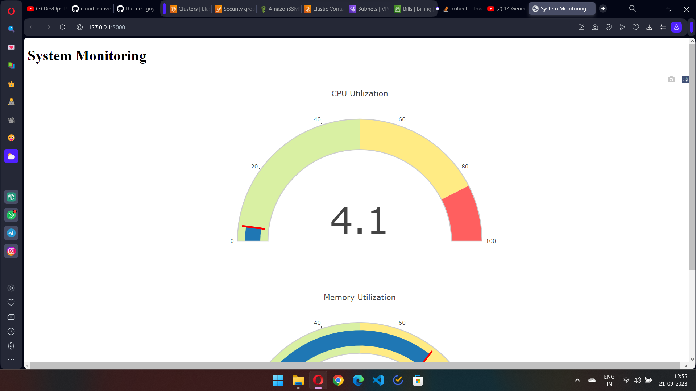

# Cloud-Native-Monitoring

### STEP 1 : CREATING A PYTHON FILE ###

1. Open cmd and install the following things. Make sure you have python and pip installed.
   
   ```
   pip install flask
   ```    
    
   ```
   pip install psutil
   ```    
   
3. The psutil framework is used to fetch details about the CPU Usage or Memory Usage etc of the host computer.
4. Create a requirements.txt file with all the requirements and run the command to install all of them into the system
   
   ```
   pip install -r requirements.txt
   ```
    
6. Once done, create a python file and copy the code.
7. The code creates two variables and fetches the value of cpu usage and memory usage using the psutil built-in functions
8. If the values are more than 80 (independently), then a warning message is shown
9. The render template is used to generate output from a template file based on the Jinja2 engine that is found in the application's templates folder

----------------------------------------------------------------------------------------------------------------------------------------------

### STEP 2 : CREATING AN HTML FILE ###

1. Create a folder called *templates*
2. Inside the folder, create an html file
3. Copy the code inside the html file. Ignore the errors/warnings.
4. The code uses a JS Script called Plotly.js which helps to visualize the readings of cpu_usage and mem_usage in terms of gauges, graphs or plots.
5. Inside the JS Script, make sure to keep the same *value* name assigned to the *render_template* in the python file. Just keep the same, if you dont undrstand.

----------------------------------------------------------------------------------------------------------------------------------------------

### STEP 3 : RUN ON LOCALHOST ###

1. Open terminal (VSCODE) and run the follwing command to start the server on localhost. Once started, click on the URL to open the server.
   
   ```
   python _name_.py
   ```
   
   In my case, it is app.py
3. You can see the readings and the visualization using a gauge reader on the screen. You can also refresh to see the changing cpu and memory usage.

----------------------------------------------------------------------------------------------------------------------------------------------

### STEP 4 : DOCKERFILE ###

1. Once the server is run on localhost, the next aim would be to use docker to create an image from the code and make a container.
2. For that, create a *Dockerfile* and copy the code.
3. The base image is Python:3.9.18-slim-bullseye from Dockerhub.
4. Then we set the working directory in the container
5. Then we copy the file requirements.txt into the dockerfile
6. Then we run the command to install all the dependencies
7. Then we copy everything else into the dockerfile
8. Then we set the environment variable for the flask app
9. Expose port 5000 to run the app
10. Start the flask app when the container runs

11. Once the code is copied, the following command is run to create a docker image. Give a custom name of the application 
    
    ```
    docker build -t status-monitoring-app .
    ```
   
13. Once the image is created, we run the following command to create the container out of it using the unique id/name and to start the server. You can see the image id by running the command ``` docker images ``` and copy the respective id from the list.
    
    ```
    docker run -p 5000:5000 8fd5b56a199b
    ```

----------------------------------------------------------------------------------------------------------------------------------------------

### STEP 5 : ELASTIC CONTAINER REGISTRY ###

1. Login to your AWS Console and create an user from IAM
2. Click on the user and create an access key with proper authentication
3. Click on permissions and search for ``` AmazonEC2ContainerRegistryFullAccess ``` and provide the access
4. Open AWS documentation and setup AWS CLI for windows
5. Open CMD and type ``` aws congifure ``` and provide the perfect Access credentials.
6. Now create an environment for python with the following command. Afterwards activate the environment.
   ```
   python -m venv myenv
   ```
   ```
   myenv\Scripts\activate
   ```
7. If you face any error, mostly its related to Powershell's executing policy. For that, open powershell as administrator and type the following command.
   ```
   Set-ExecutionPolicy RemoteSigned
   ```
8. Now install boto3 inside your environment by ```pip install boto3```
9. Once its done, create a new file called _ecr.py_ and copy the copy and finally run it using ```python ecr.py```
10. You will be provided with the ECR url. You can login to your Amazon account and navigate to ECR to confirm this.
11. Inside the ECR, click on View Push Commands and copy paste the commands in your vs code terminal and run them one by one.
12. Once the docker image is created and pushed into the ECR Repo, you can find the image with the corresponding name.

--------------------------------------------------------------------------------------------------------------------------------------------------

### STEP 6 : ELASTIC KUBERNETES SERVICES ###

1. Go to EKS under Computer in AWS
2. Click on Create new cluster
3. Create a cluster with the on-screen instructions. Provide proper VPC, subnet and Security Groups. Make sure to have 5000 port enabled in the security group.
4. Finally click on *Create Cluster* and wait for a couple of minutes as it is going to take time.
5. Once the cluster is created, click on *Compute* and click on *Add a new node group*
6. Follow the on screen instructions. Make sure to have *t2 micro* as it comes under free tier otherwise you will be charged. Proceed further and click on Create a Node Group.

--------------------------------------------------------------------------------------------------------------------------------------------------

### STEP 7 : CREATE DEPLOYMENT AND SERVICE

1. Create a file called *myeks.py* and copy the code
2. Make sure to change the Image URI on line number 26 from your image in ECR
3. Download kubernetes inside the environment using ```pip install kubernetes```
4. Run the file using ```python myeks.py```
5. Now run by checking the following commands - 
   ```
   kubectl get deployment -n default (to check deployments)
   kubectl get service -n default (to check service)
   kubectl get pods -n default (to check the pods)
   ```
6. Once the pods are running, run the port-forward to expose the service. Run the following command - 
   ```
   kubectl port-forward service/<service_name> 5000:5000
   ```
7. Now you can also view the application in your localhost using ```localhost:5000```



------------------------------------------------------------------------------------------------------------------------------------------------------

### STEP 8 : DELETE RESOURCES ###

Make sure to delete node groups and cluster from EKS and the images from ECR in AWS to prevent excessive billing. You can also visit ```Billing``` in AWS account to view the proper billing structure and analyse the cost per usage.